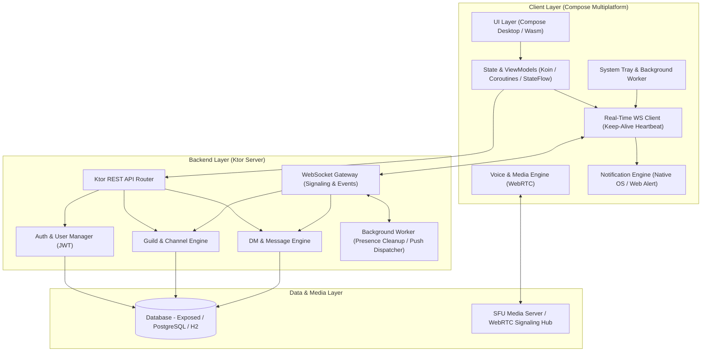

# Conflux - Discord Clone (Kotlin Multiplatform & Ktor)

Conflux 是一個基於 **Kotlin Multiplatform (KMP)** 與 **Ktor Server** 的 Discord 翻版跨平台即時通訊與語音軟體。支援 Web (Wasm/JS)、Desktop (JVM) 等前端平台，提供**私訊 (DM)**、**伺服器 (Servers/Guilds)**、**頻道 (Channels)**、**即時文字與語音聊天**、**跨平台通知系統**以及**背景常駐服務 (Background Services)**。

---

## 🏗️ 系統架構規劃 (Architecture Overview)

本專案採用 **Client-Server 雙層混合架構**，結合 RESTful API 提供數據持久化、WebSocket 進行雙向即時通訊與狀態廣播、WebRTC 處理低延遲語音串流，以及獨立的**背景常駐服務與推播通知引擎**。



### 架構層級說明

1. **Client Layer (前端層)**:
   - **Compose Multiplatform UI**: 構建 Discord 經典三欄式介面（伺服器欄、頻道/DM列表欄、主聊天/語音視窗欄與成員欄）。
   - **StateFlow & ViewModels**: 實現響應式狀態管理與狀態驅動 UI。
   - **WebSocket Client & Keep-Alive**: 保持與伺服器長連接，包含心跳包 (Heartbeat) 與自動斷線重連機制。
   - **Background Worker & System Tray**: Desktop 端支援縮小至系統托盤 (System Tray) 常駐背景執行；主視窗關閉時背景語音與通訊不中斷。
   - **Notification Manager**: 處理 Desktop 原生通知 (Windows Toast / macOS Notify) 與 Web Notification API，並提供應用程式內音效（語音進出、@提及標註提示音）。
   - **WebRTC Engine**: 處理音訊擷取、聲音編解碼與 Peer-to-Peer / SFU 語音通訊。

2. **Backend Layer (後端層)**:
   - **Ktor REST Server**: 負責註冊、登入、伺服器建立、成員權限控制等管理類 API。
   - **WebSocket Event Gateway**: 處理即時訊息廣播、成員狀態 (Presence) 變更通知及語音 Channel 的 WebRTC 信令轉發 (Signaling)。
   - **Background Worker Jobs**: 後端背景定時任務，包含在線狀態超時清理 (Client Presence Timeout) 與非同步推播發送。

3. **Data & Media Layer (資料與媒體層)**:
   - **Database (Exposed ORM)**: 存儲使用者資料、伺服器結構、頻道、權限角色以及歷史聊天紀錄。
   - **SFU (Selective Forwarding Unit) / Signaling Hub**: 支援多人語音頻道高流暢音訊轉發。

---

## 🛠️ 技術棧規劃 (Tech Stack)

| 層級 (Layer) | 技術選型 (Tech Stack) | 說明與用途 (Description) |
| :--- | :--- | :--- |
| **前端 Cross-Platform** | Kotlin Multiplatform, Compose Multiplatform | 涵蓋 Desktop (JVM) 與 Web (Wasm/JS) |
| **前端狀態管理與 DI** | Koin, Kotlin Coroutines, StateFlow | 統一跨平台依賴注入與非同步狀態管理 |
| **後端 Server** | Ktor Framework (Kotlin) | 高效非同步 REST API 與 WebSocket 伺服器 |
| **即時通訊 (Real-Time)** | Ktor WebSockets + Heartbeat Keep-Alive | 用於實時訊息推播、在線狀態 (Presence) 與 WebRTC 信令 |
| **背景常駐與通知** | System Tray (JVM) / Web Notifications API / Audio Player | 系統托盤常駐、背景語音保持與原生推播通知 |
| **語音通訊 (Voice Chat)** | WebRTC / LiveKit SFU | 低延遲 Peer-to-Peer 或 SFU 多人語音串流 |
| **資料庫 (Database)** | Exposed ORM + PostgreSQL / H2 | 儲存使用者、伺服器、頻道與對話紀錄 |
| **身份認證 (Auth)** | JWT (JSON Web Tokens) + Password Hashing | 安全的身份認證與權限控管 |

---

## 📋 開發規劃與任務清單 (Roadmap & TODO Checklist)

### 🔹 Phase 1: 基礎架構與身份認證 (Auth & User Foundation)
- [ ] **數據庫與 Data Model 設計**
  - [ ] 使用者數據表 (Users: id, username, email, avatar, status_message)
  - [ ] 密碼哈希加密與 JWT 簽發/驗證機制
- [ ] **認證功能**
  - [ ] 註冊與登入 REST API (`/api/auth/register`, `/api/auth/login`)
  - [ ] 前端登入/註冊 UI 與 Token 持久化儲存
  - [ ] 在線狀態管理 (Online, Idle, DND, Offline) 廣播機制

### 🔹 Phase 2: 私訊系統 (Direct Messaging - DM)
- [ ] **好友與對話關係 (Friends & DM Relationships)**
  - [ ] 好友請求、好友列表、黑名單 API
  - [ ] 建立 1-on-1 私訊房與群組私訊 (Group DM)
- [ ] **即時訊息傳輸 (Real-time DM Chat)**
  - [ ] WebSocket DM 信道 ( Send / Receive / Typing Indicator )
  - [ ] 訊息歷史紀錄分頁載入 (Message Pagination & Persistence)
  - [ ] 未讀訊息提示 (Unread Badges & Read Receipts)

### 🔹 Phase 3: 伺服器與頻道系統 (Servers & Channels)
- [ ] **伺服器管理 (Guild Management)**
  - [ ] 建立 / 編輯 / 刪除伺服器 (Server Icon, Name, Description)
  - [ ] 伺服器邀請碼機制 (Invite Link / Unique Code)
  - [ ] 成員列表與身份組權限 (Roles & Permissions: Admin, Moderator, Member)
- [ ] **頻道架構 (Categories & Channels)**
  - [ ] 文字頻道 (Text Channels) 與類別分組 (Categories)
  - [ ] 語音頻道 (Voice Channels) 類別劃分
  - [ ] 頻道文字聊天 (Channel Text Chat, WebSocket 多播廣播)

### 🔹 Phase 4: 語音聊天系統 (Voice Chat System)
- [ ] **信令伺服器 (WebRTC Signaling Gateway)**
  - [ ] WebSocket 信令交換 (Offer, Answer, ICE Candidates)
  - [ ] 進入 / 離開語音頻道房間之成員狀態廣播
- [ ] **語音串流引擎 (Media Engine)**
  - [ ] WebRTC Native/JS 音訊串流整合 (Mic Capture, Audio Output Stream)
  - [ ] 靜音 (Mute)、麥克風閉音 (Deafen)、說話狀態視覺高亮 (Speaking Indicator)
  - [ ] 多人語音會議架構 (SFU 伺服器整合與音量控制)

### 🔹 Phase 5: 背景程序與通知系統 (Notifications & Background Services)
- [ ] **背景常駐服務 (Client Background Services)**
  - [ ] **Desktop 系統托盤 (System Tray)** 整合（關閉主視窗時隱藏至托盤繼續在背景運行）
  - [ ] **背景語音引擎保持 (Background Audio Engine)**：即使視窗縮小，語音通話與麥克風收音依舊持續
  - [ ] **WebSocket 心跳包與斷線自動重連 (Heartbeat & Reconnect Worker)**
- [ ] **跨平台推播與通知 (Notification System)**
  - [ ] **桌面/瀏覽器原生通知**：收到私訊或 @提及 (@mention) 時觸發 OS Native Notifications / Web Notifications API
  - [ ] **應用程式內通知音效 (Sound Effects)**：訊息送達音、進入/離開語音頻道音效、靜音開關提示音
  - [ ] **通知偏好設定**：伺服器/頻道靜音 (Mute Server/Channel) 與 免打擾模式 (Do Not Disturb) 邏輯處理

### 🔹 Phase 6: Discord 風格 UI/UX 與細節優化
- [ ] **UI 介面重構 (Discord Style Layout)**
  - [ ] 三欄式經典佈局 (伺服器選單欄、頻道/DM選單欄、主聊天/語音區、成員列表區)
  - [ ] 深色模式 (Dark Theme)、調色盤與極簡現代微動畫
  - [ ] 訊息富文本 (圖片/檔案上傳 preview, Markdown 渲染, Emoji 貼圖支援)

---

## 🚀 專案建置與執行 (Build & Run)

### 1. 執行 Desktop (JVM) 應用程式
- **macOS / Linux**:
  ```shell
  ./gradlew :composeApp:run
  ```
- **Windows**:
  ```shell
  .\gradlew.bat :composeApp:run
  ```

### 2. 執行 Ktor 伺服器
- **macOS / Linux**:
  ```shell
  ./gradlew :server:run
  ```
- **Windows**:
  ```shell
  .\gradlew.bat :server:run
  ```

### 3. 執行 Web (Wasm/JS) 應用程式
- **Wasm Target (推薦)**:
  ```shell
  ./gradlew :composeApp:wasmJsBrowserDevelopmentRun
  ```
- **JS Target**:
  ```shell
  ./gradlew :composeApp:jsBrowserDevelopmentRun
  ```